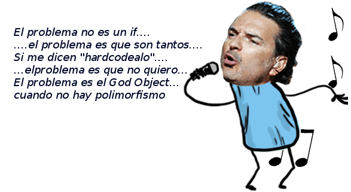

# Tamagotchi

## Introducción

Leemos bien el [enunciado](https://docs.google.com/document/d/1jLvvIVhdqvE8F7HOyfrOz_fpYe8L7NKWC_fDKYup_2I/edit)
y empezamos a buscar **objetos candidatos**, es decir, qué objetos podrían servirnos para
resolver los requerimientos.

Esto dependerá de las respuestas, podemos imaginar

- el tamagotchi
- *los estados* del tamagotchi
- alguno podría pensar en *las acciones* del tamagotchi, esto nos lleva a repasar la idea de modelar comportamiento como un objeto como una abstracción interesante y como concepto equivalente al de *orden superior* de funcional y lógico

## Servicios de un tamagotchi

El primer impulso es sentarse a codificar el tamagotchi, o modelar en un diagrama estático que un Tamagotchi tiene felicidad. Bajemos un cambio y pensemos en cómo queremos usar el Tamagotchi, qué cosas sabe hacer:

- comer
- jugar solo
- jugar con alguien

Alguien podrá pensar: "Ah, jugar podría ser un solo método, y le pasamos con quién juega. Si es *null* quiere jugar solo". Ok, pero eso *esconde* o **no revela** la intención de estar jugando solo. Son dos conceptos diferentes, entonces está bueno pensar en que tengo dos formas diferentes de jugar en mi sistema.

## Estados como objeto

- Si al comer tenemos que estar preguntando por el estado....
- ...pero también al jugar solo...
- ...y una vez más al jugar con alguien...

...eso significa que estamos necesitando diferenciar los estados, porque **cada estado tiene diferente comportamiento**.

Como dice nuestro amigo guatemalteco:

