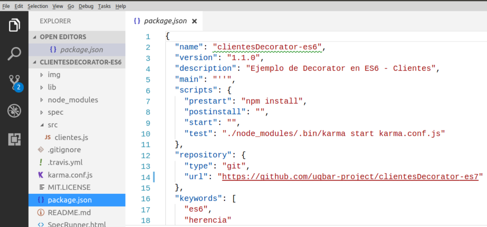

# Instalar extensiones para nuestro editor

Agregale las extensiones para el Visual Studio Code según muestra [esta página](http://wiki.uqbar.org/wiki/articles/instalacion-de-entorno-javascript.html)

# Tecnologías

Para crear un proyecto desde cero vamos a tomar como base un proyecto existente, de manera muy similar a lo que hicimos en Algoritmos 2 con un proyecto en Xtend, solo que con herramientas similares.

- **npm** o node package manager: para resolver las dependencias (la función equivalente la cumplía Maven)
- **Jasmine** para definir los tests (el equivalente a JUnit) + **Karma** que nos permitirá automatizar las tareas mediante npm
- El código que vamos a escribir en Ecmascript 6 se traducirá a Javascript 5 que es compatible con más tecnologías, mediante un *transpilador* que se llama Babel (algo equivalente a lo que hace xtend traduciendo código xtend a Java)


# Cómo iniciar el proyecto

## Clonar un ejemplo de otro repositorio

Desde el git bash o la consola nos posicionamos en un directorio y bajamos algún ejemplo base, por ejemplo el que muestra la herencia de clientes:

```bash
$ git clone https://github.com/uqbar-project/clientesHerencia-es6
```

## Generar nuestro nuevo proyecto

Debemos construir un directorio paralelo que tenga esta estructura:

```bash
+ proyectoNuevo (el nombre que quieran)
  + src
  + spec
```

## Copiar archivos de definición de un proyecto

Del ejemplo base vamos a copiar dos archivos importantes al directorio raíz de nuestro proyecto:

- **package.json**: el equivalente al pom.xml, contiene información sobre el proyecto y sus dependencias
- **karma.conf.js**: contiene la configuración para ejecutar los tests desde un script
- **.travis.yml**: es el archivo que contiene la configuración para poder ejecutar en un server de Continuous Integration nuestro ejemplo

Nos debería quedar entonces la siguiente estructura:

```bash
+ proyectoNuevo (el nombre que quieran)
  + src
  + spec
  - package.json
  - karma.conf.js
  - .travis.yml
```

## Editar el package.json

Abrimos el Visual Studio Code y editamos la información del package.json



Hay que cambiar estos atributos:

- name
- description
- keywords
- repository, y dentro la url

## Bajar dependencias

Por el momento solo tenemos la cáscara, vamos a bajar las dependencias necesarias para nuestro proyecto escribiendo

```bash
$ npm install
```

Esto va a dejar en el directorio node_modules todos los archivos .js con las librerías y frameworks necesarios. La estructura de nuestro proyecto quedaría

```bash
+ proyectoNuevo (el nombre que quieran)
  + src
  + spec
  + node_modules (nuevo)
  - package.json
  - karma.conf.js
  - .travis.yml
```

## Escribir una primera definición

Dentro de Visual Studio Code, agregamos un archivo clientes.js en el directorio **src** y escribimos el código que queremos, por ejemplo:

```javascript
// Definición de un cliente
class Cliente {
	// Atributos
	constructor() {
		this.deuda = 0
	}
}
```

## Escribir el primer test

Dentro de Visual Studio Code, agregamos un archivo clientes.js en el directorio **spec** y escribimos los casos de prueba deseados, algo como:

```javascript
describe('clientes', () => {
    let jorge
  
    beforeEach(() => {
      jorge = new Cliente()
    })
  
    it('jorge tiene saldo cero inicialmente', () => {
        expect(0).toBe(jorge.deuda)
    }) 
  })
```

## Estado de nuestro proyecto

La estructura resultante debería ser:

```bash
+ proyectoNuevo (el nombre que quieran)
  + src
    - clientes.js
  + spec
    - clientes.js
  + node_modules (nuevo)
  - package.json
  - karma.conf.js
  - .travis.yml
```

## Script de prueba

Para probarlo, podemos hacerlo desde la consola Linux, por git bash o desde el Visual Studio Code utilizando la consola integrada (View | Integrated Terminal o el shortcut "Ctrl" + "\`")

```bash
$ npm test
```

Con la configuración que tiene el package.json y karma.conf.js, se ejecutan los tests, y veremos un color verde si pasan todos ok o bien los mensajes de error correspondientes.

